<!-- docs-audit: src/emails/*, src/actions/newsletters.ts, src/lib/resend.ts -->
# Realtors360 CRM — Email Flow Diagrams

> To render these diagrams, open in GitHub (renders natively) or paste into [mermaid.live](https://mermaid.live)

## 1. Complete Email Ecosystem

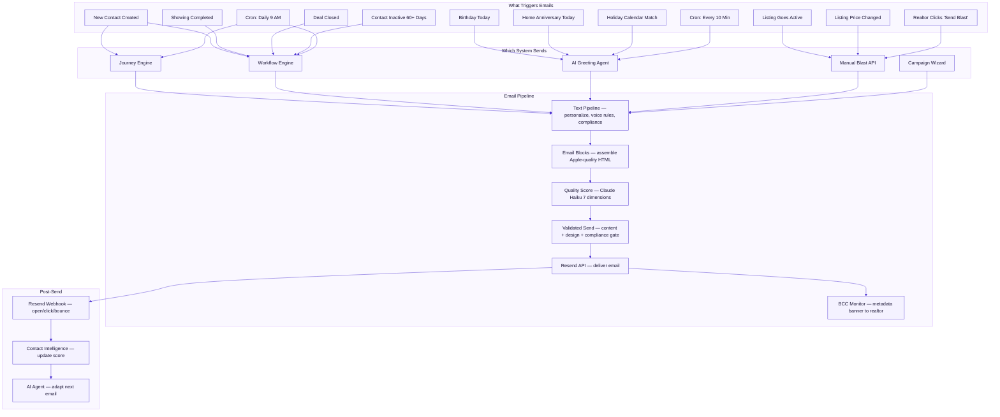

---

## 2. Email Types — What Each Contact Receives

```mermaid
%%{init: {'theme': 'base', 'themeVariables': {'primaryColor': '#e8e0ff', 'primaryBorderColor': '#4f35d2', 'primaryTextColor': '#1a1535', 'lineColor': '#4f35d2', 'secondaryColor': '#f4f2ff', 'tertiaryColor': '#fff', 'background': '#ffffff', 'mainBkg': '#f4f2ff', 'nodeBorder': '#4f35d2', 'clusterBkg': '#faf8ff', 'clusterBorder': '#d8b4fe', 'titleColor': '#1a1535', 'edgeLabelBackground': '#ffffff'}}}%%
graph LR
    subgraph BUYER["Buyer Contact Receives"]
        B1[Welcome Email]
        B2[Neighbourhood Guide]
        B3[New Listing Alert — weekly]
        B4[Market Update — monthly]
        B5[Mortgage Pre-Approval Guide]
        B6[Buying Process Overview]
        B7[Making an Offer Guide]
        B8[Closing Checklist]
        B9[Congratulations — deal closed]
        B10[Move-In Checklist]
        B11[30-Day Maintenance Tips]
        B12[90-Day Referral Ask]
        B13[6-Month Equity Update]
        B14[1-Year Anniversary]
    end

    subgraph SELLER["Seller Contact Receives"]
        SE1[Welcome + CMA Preview]
        SE2[Market Update for Sellers]
        SE3[Weekly Showing Summary]
        SE4[Congratulations on Sale]
        SE5[What's Next + Moving Resources]
        SE6[30-Day Referral Ask]
        SE7[90-Day Market Update]
        SE8[6-Month Neighbourhood Update]
        SE9[1-Year Anniversary]
    end

    subgraph GREETINGS["Everyone Receives — Greetings"]
        G1[🎂 Birthday]
        G2[🏠 Home Anniversary]
        G3[🎄 Christmas]
        G4[🎆 New Year]
        G5[🪔 Diwali]
        G6[🧧 Lunar New Year]
        G7[🍁 Canada Day]
        G8[🦃 Thanksgiving]
        G9[💝 Valentine's Day]
        G10[💐 Mother's Day]
        G11[👔 Father's Day]
    end

    subgraph AGENTS["Agent/Partner Receives"]
        A1[Listing Blast — New Listing Alert]
        A2[Listing Blast — Luxury Showcase]
        A3[Listing Blast — Open House Invite]
        A4[Partner Welcome]
        A5[Partner Market Update]
        A6[Partner Quarterly Newsletter]
        A7[Partner Annual Recap]
    end
```

---

## 3. Buyer Journey — Complete Email Timeline

```mermaid
%%{init: {'theme': 'base', 'themeVariables': {'primaryColor': '#4f35d2', 'primaryBorderColor': '#4f35d2', 'primaryTextColor': '#ffffff', 'lineColor': '#4f35d2', 'secondaryColor': '#e8e0ff', 'tertiaryColor': '#f4f2ff', 'background': '#ffffff', 'gridColor': '#e5e7eb', 'todayLineColor': '#ff5c3a'}}}%%
gantt
    title Buyer Journey Email Sequence
    dateFormat X
    axisFormat Day %s

    section Lead Phase
    Welcome Email                   :done, 0, 1
    Welcome SMS                     :done, 0, 1
    Neighbourhood Guide             :done, 3, 4
    Listing Alert #1                :done, 7, 8
    Market Update                   :done, 14, 15
    Listing Alert #2                :done, 21, 22

    section Active Phase (after showing booked)
    Weekly Listings                  :active, 28, 29
    Market Report                   :active, 42, 43

    section Under Contract (after offer accepted)
    Neighbourhood Welcome Guide     :crit, 44, 45

    section Past Client (after deal closed)
    Home Anniversary                :milestone, 74, 75
    Quarterly Market Update         :milestone, 134, 135
    Referral Ask                    :milestone, 254, 255
    Annual Anniversary              :milestone, 439, 440
```

---

## 4. Workflow Step Types — What Gets Sent

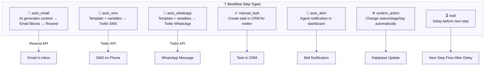

---

## 5. Customer (Lead) Qualification Flow

> Customers are unqualified leads. They receive generic nurture until the realtor converts them to Buyer or Seller.

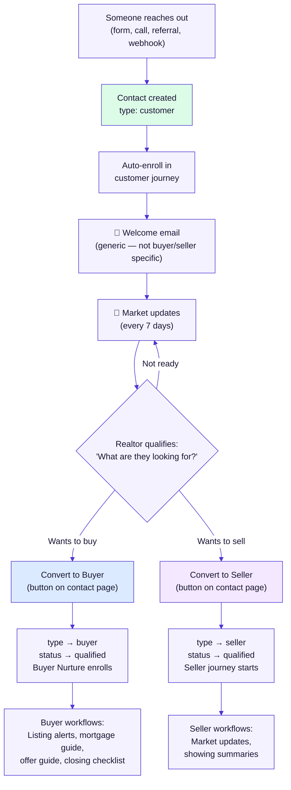

---

## 5b. Contact Types — Who Gets What

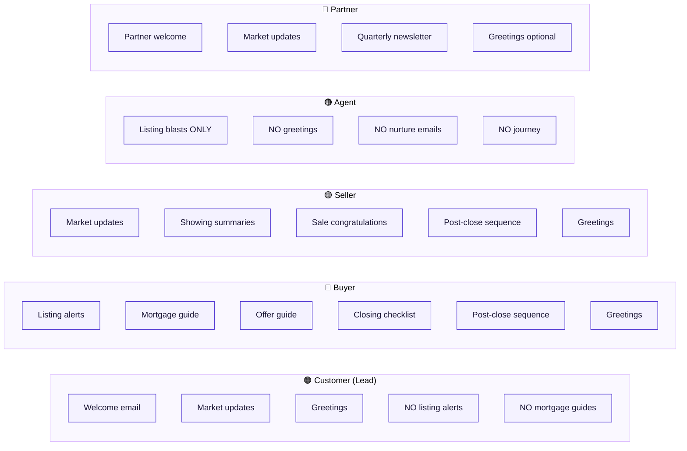

---

## 6. Speed-to-Contact Workflow (Inactive by Default — Manual Enable)

> This workflow is **inactive by default**. The realtor enables it from the AI Workflows tab and manually enrolls contacts. New contacts do NOT auto-enroll.

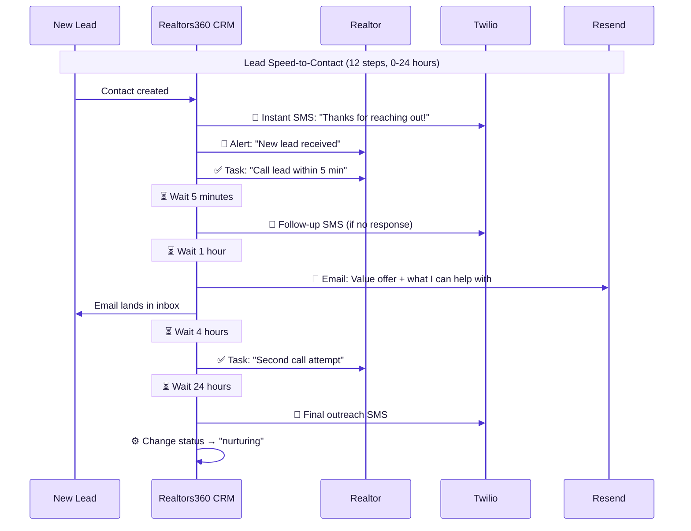

---

## 6. Post-Close Buyer Workflow

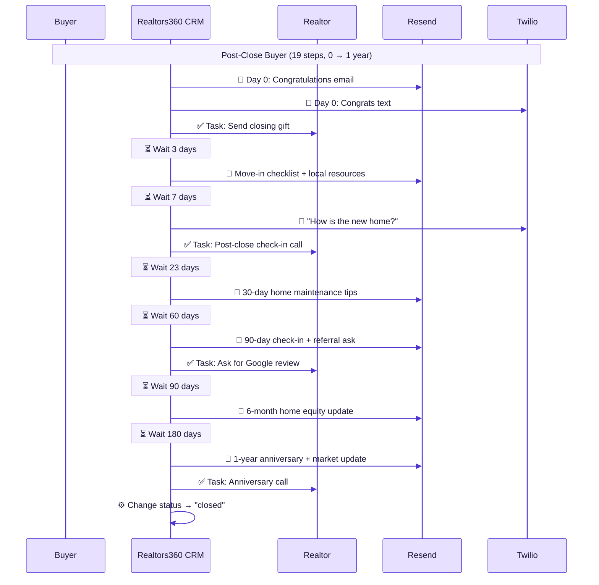

---

## 7. Buyer Nurture Plan Workflow

> **Trigger:** Realtor changes lead status (e.g., new → qualified). **Contact type:** Buyer only. **Duration:** ~30 days.

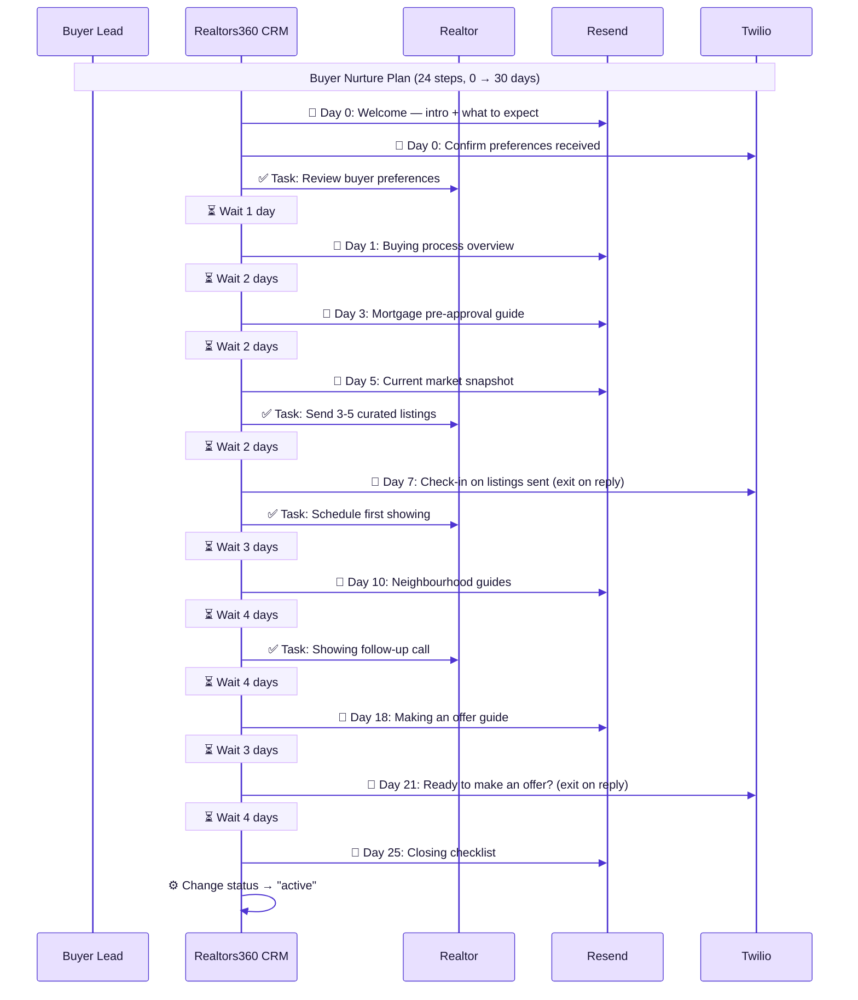

---

## 8. Post-Close Seller Workflow

> **Trigger:** Listing status changes to "sold" (seller contact). **Duration:** 0 → 1 year.

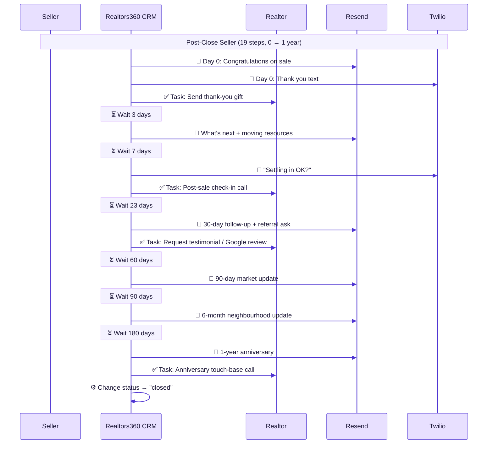

---

## 9. Lead Re-Engagement Workflow

> **Trigger:** Contact inactive for 60+ days (detected by daily inactivity check). **Contact type:** Any. **Duration:** ~28 days.

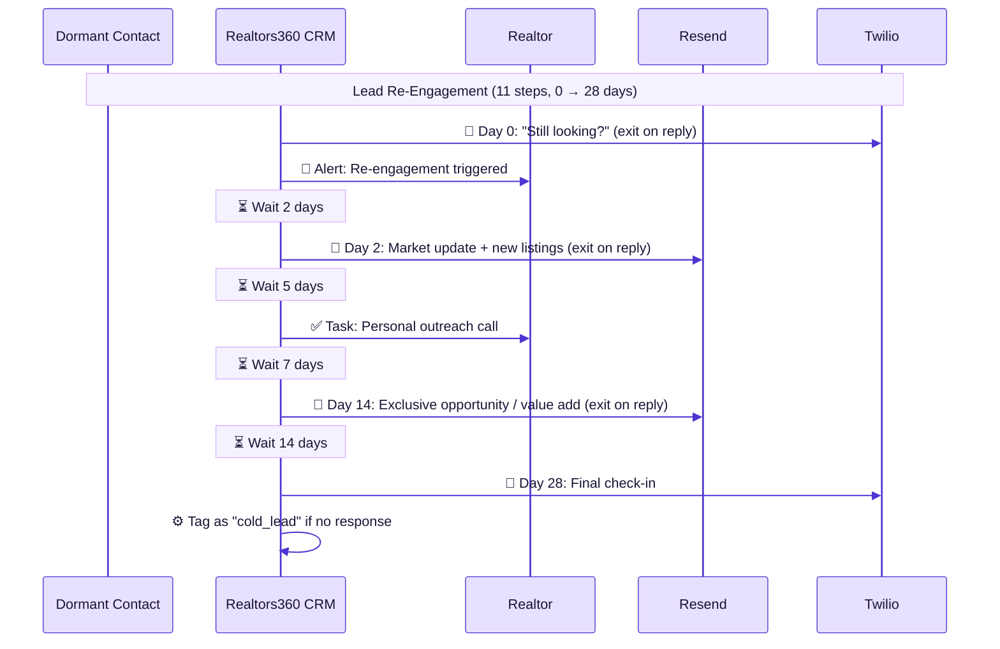

---

## 10. Open House / Showing Follow-Up Workflow

> **Trigger:** Showing confirmed (seller replies YES to SMS). **Contact type:** Buyer. **Duration:** ~7 days.

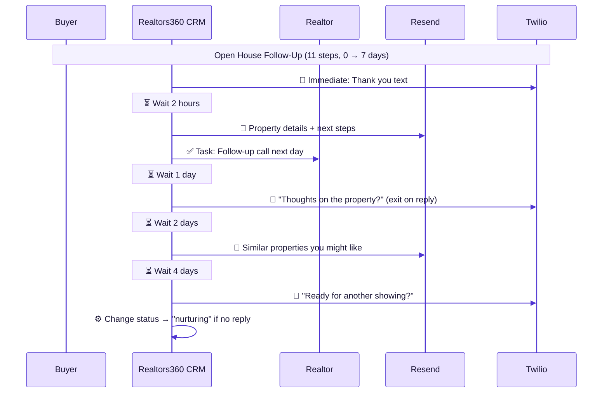

---

## 11. Referral Partner Workflow

> **Trigger:** Realtor adds "referral_partner" tag to contact. **Contact type:** Any. **Duration:** ~6 months.

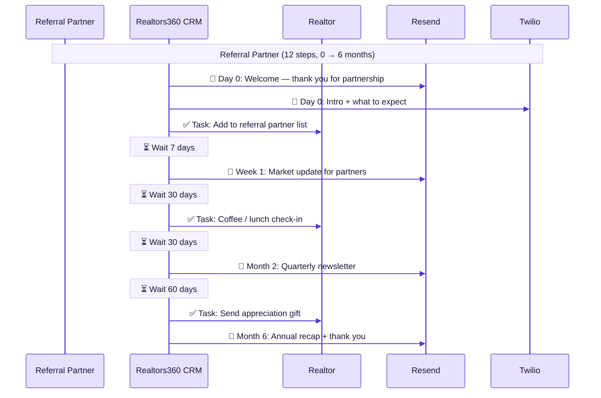

---

## 12. Greeting Agent Decision Flow (AI-Powered)

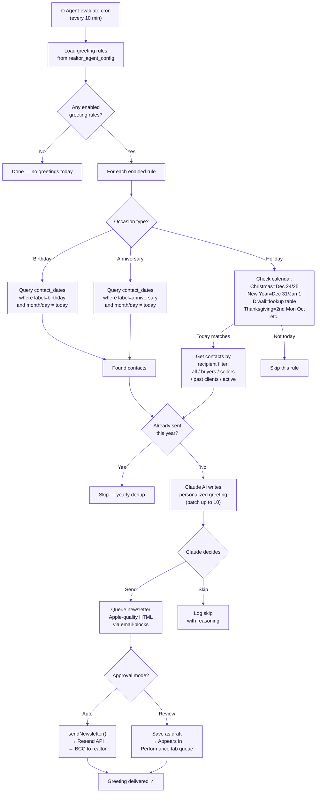

---

## 13. Listing Blast Automation Flow

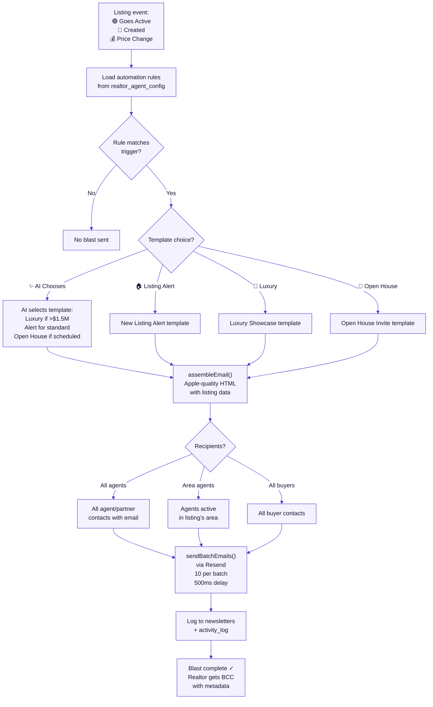

---

## 14. Email Content Templates — What They Look Like

```mermaid
%%{init: {'theme': 'base', 'themeVariables': {'primaryColor': '#e8e0ff', 'primaryBorderColor': '#4f35d2', 'primaryTextColor': '#1a1535', 'lineColor': '#4f35d2', 'secondaryColor': '#f4f2ff', 'tertiaryColor': '#fff', 'background': '#ffffff', 'mainBkg': '#f4f2ff', 'nodeBorder': '#4f35d2', 'clusterBkg': '#faf8ff', 'clusterBorder': '#d8b4fe', 'edgeLabelBackground': '#ffffff'}}}%%
graph TD
    subgraph LISTING_ALERT["🏠 New Listing Alert"]
        LA1["Header: Realtors360 branding"]
        LA2["Hero: Full-width property photo\nwith dark overlay + address"]
        LA3["Price Bar: $1,290,000\n3 BD · 2 BA · 1,847 sqft"]
        LA4["Personal Note: AI-written\n'This ground floor unit just hit...'"]
        LA5["Features: 3 icon cards\nGround Floor · Kits Elementary · Premium Finishes"]
        LA6["Photo Gallery: 2x2 grid"]
        LA7["CTA: 'Schedule a Viewing' pill button"]
        LA8["Agent Card: photo + name + phone"]
        LA9["Footer: unsubscribe + address"]
        LA1 --> LA2 --> LA3 --> LA4 --> LA5 --> LA6 --> LA7 --> LA8 --> LA9
    end

    subgraph LUXURY["💎 Luxury Showcase"]
        LX1["Dark background (#0a0a0a)"]
        LX2["Gold accent (#c4a35a)"]
        LX3["Playfair Display serif font"]
        LX4["Full-bleed hero photo"]
        LX5["Gold price + specs"]
        LX6["Editorial description"]
        LX7["Gold-bordered CTA\n'Request Private Viewing'"]
        LX1 --> LX2 --> LX3 --> LX4 --> LX5 --> LX6 --> LX7
    end

    subgraph GREETING["🎂 Birthday Greeting"]
        GR1["Gradient header with emoji 🎂"]
        GR2["AI-written personal message:\n'Happy Birthday! I've been thinking\nabout your neighbourhood...'"]
        GR3["Agent signature card"]
        GR4["Minimal footer — no sales pitch"]
        GR1 --> GR2 --> GR3 --> GR4
    end

    subgraph MARKET["📊 Market Update"]
        MK1["Gradient hero header"]
        MK2["Stats Row:\nAvg Price · DOM · Inventory · Sales Ratio"]
        MK3["AI personal note:\n'The spring market is heating up...'"]
        MK4["Recent Sales table"]
        MK5["CTA: 'View Full Report'"]
        MK1 --> MK2 --> MK3 --> MK4 --> MK5
    end
```

---

## 15. Complete System — All 46 Workflow Emails

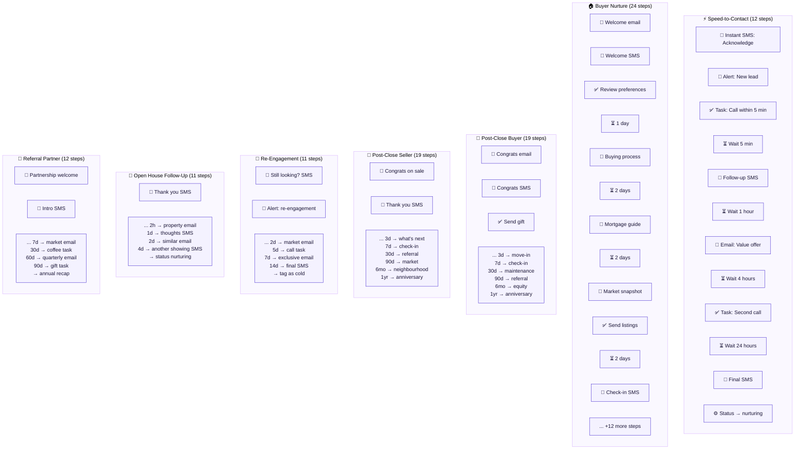

---

## 16. Engagement Tracking & Feedback Loop

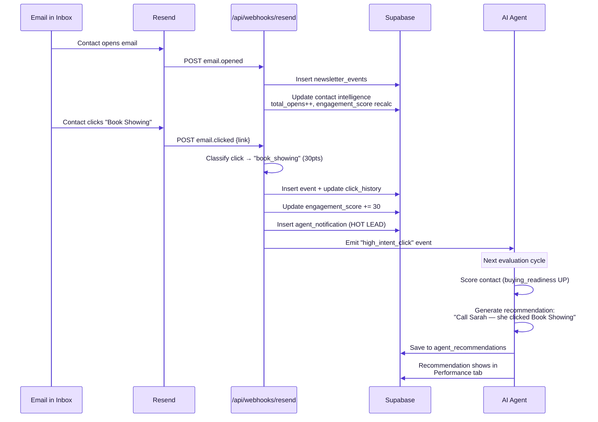

---

## 17. Send Decision Pipeline

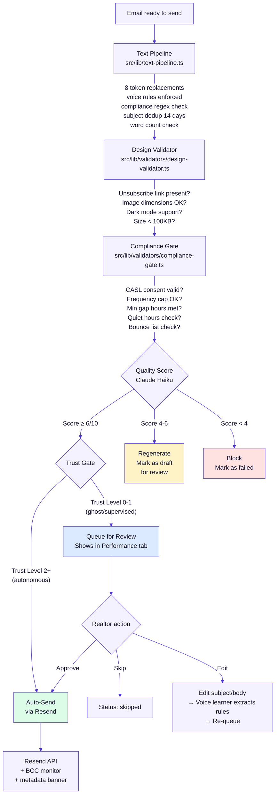

---

## Summary: Every Email a Contact Can Receive

| # | Email | Trigger | System | Template Style |
|---|-------|---------|--------|---------------|
| 1 | Welcome | Contact created | Journey Engine | Gradient hero + personal note |
| 2 | Neighbourhood Guide | 3 days after join | Journey Engine | Gradient + area highlights |
| 3 | New Listing Alert | Weekly / listing match | Journey + Blast | Hero photo + price bar + gallery |
| 4 | Market Update | Monthly | Journey Engine | Stats row + recent sales |
| 5 | Buying Process Guide | Day 5 | Buyer Nurture | Gradient + personal note |
| 6 | Mortgage Guide | Day 7 | Buyer Nurture | Gradient + personal note |
| 7 | Making an Offer | Day 18 | Buyer Nurture | Gradient + personal note |
| 8 | Closing Checklist | Day 25 | Buyer Nurture | Gradient + personal note |
| 9 | Congratulations | Deal closed | Post-Close | Gradient + celebration |
| 10 | Move-In Checklist | Day 3 post-close | Post-Close Buyer | Gradient + resource list |
| 11 | Maintenance Tips | Day 30 | Post-Close Buyer | Gradient + checklist |
| 12 | Referral Ask | Day 90 | Post-Close | Gradient + personal note |
| 13 | Equity Update | 6 months | Post-Close Buyer | Gradient + comparison |
| 14 | Anniversary | 1 year | Post-Close | Gradient + celebration |
| 15 | Re-Engagement | 60 days inactive | Re-Engagement | Gradient + market stats |
| 16 | Property Details | After showing | Open House Follow-Up | Hero photo + price bar |
| 17 | Similar Properties | 2 days post-showing | Open House Follow-Up | Gradient + property grid |
| 18 | Luxury Showcase | Listing blast ($1.5M+) | Listing Blast | Dark bg + gold accents |
| 19 | Open House Invite | Listing blast | Listing Blast | Gradient event header |
| 20 | Partner Welcome | Tag added | Referral Partner | Gradient + personal note |
| 21 | Partner Market Update | 7 days | Referral Partner | Gradient + stats |
| 22 | Partner Quarterly | 60 days | Referral Partner | Gradient + recap |
| 23 | Partner Annual | 1 year | Referral Partner | Gradient + celebration |
| 24 | 🎂 Birthday | Birthday date | AI Greeting Agent | Gradient header + emoji |
| 25 | 🏠 Home Anniversary | Closing date | AI Greeting Agent | Anniversary + value |
| 26 | 🎄 Christmas | Dec 24/25 | AI Greeting Agent | Holiday gradient |
| 27 | 🎆 New Year | Dec 31/Jan 1 | AI Greeting Agent | Holiday gradient |
| 28 | 🪔 Diwali | Oct/Nov (varies) | AI Greeting Agent | Holiday gradient |
| 29 | 🧧 Lunar New Year | Jan/Feb (varies) | AI Greeting Agent | Holiday gradient |
| 30 | 🍁 Canada Day | Jul 1 | AI Greeting Agent | Holiday gradient |
| 31 | 🦃 Thanksgiving | 2nd Mon Oct | AI Greeting Agent | Holiday gradient |
| 32 | 💝 Valentine's | Feb 14 | AI Greeting Agent | Holiday gradient |
| 33 | 💐 Mother's Day | 2nd Sun May | AI Greeting Agent | Holiday gradient |
| 34 | 👔 Father's Day | 3rd Sun Jun | AI Greeting Agent | Holiday gradient |
