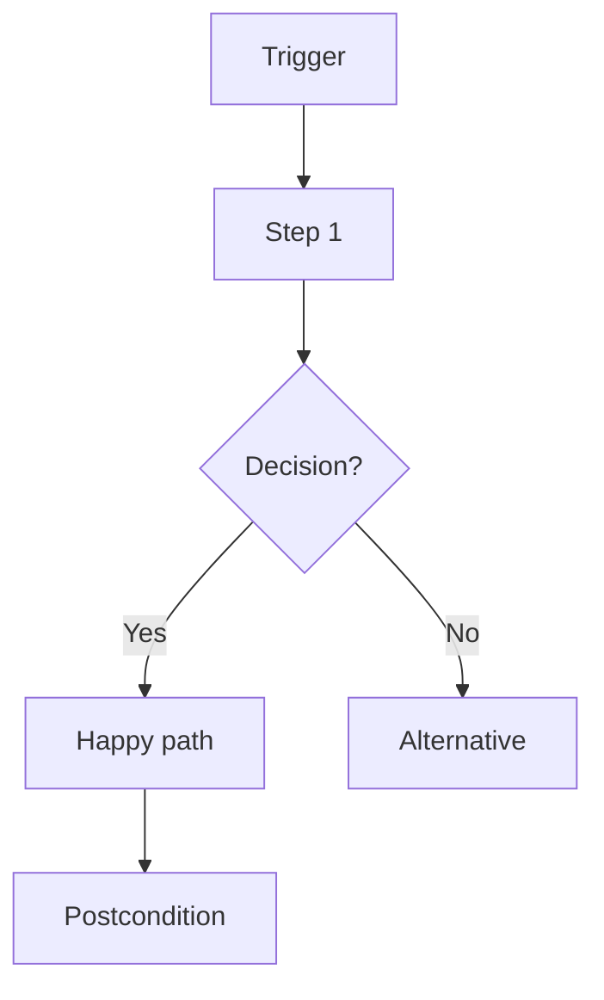

# Use Cases: [Feature Name]

> **Version:** 1.0
> **Date:** YYYY-MM-DD
> **Feature PRD:** `docs/PRD_[name].md`
> **Test Plan:** `docs/TEST_PLAN_[name].md`
> **Total Use Cases:** [target count based on scope — see playbook Section 20.4]

---

## Actors

| Actor | Description |
|-------|-------------|
| **Realtor** | Licensed BC realtor using ListingFlow daily (primary user) |
| **Buyer** | Client searching for properties |
| **Seller** | Client listing their property |
| **Other Agent** | Buyer's or seller's cooperating agent |
| **System** | Automated processes (cron, webhooks, AI agent) |
| **Admin** | Team lead managing agents and settings |

---

## Use Case Categories

| Category | Count | What It Covers |
|----------|-------|---------------|
| Core Workflows | [10-15] | Primary happy-path user journeys end to end |
| Realtor Daily Tasks | [10-15] | Morning routine, follow-up, showing prep, review |
| Client Interactions | [10-15] | Inquiry, showing, offer, follow-up |
| System Automations | [5-10] | Cron, auto-enroll, AI draft, webhook processing |
| Error Recovery | [5-10] | What happens when things go wrong, retry paths |
| Cross-Feature | [5-10] | Interactions between subsystems |
| Admin / Config | [5-10] | Settings, preferences, templates, voice rules |

---

## CORE WORKFLOWS

### UC-001: [Primary Workflow Name]

**Actor:** Realtor
**Trigger:** [What starts this use case — e.g., "Realtor receives a new lead inquiry"]
**Preconditions:**
- Realtor is logged into ListingFlow
- [Other required state]

**Main Flow:**
1. Realtor [action]
   - System: [response — what the CRM does]
2. Realtor [next action]
   - System: [response]
3. Realtor [completes workflow]
   - System: [final state change, notifications sent, records created]

**Alternative Flows:**
- **1a. [Variation]:** If [condition], then [different path] → [outcome]
- **2a. [Error case]:** If [failure], then [error handling] → [recovery options]
- **3a. [Edge case]:** If [unusual condition], then [graceful handling]

**Postconditions:**
- [Record state after completion]
- [Notifications sent]
- [Audit trail entry created]

**Business Rules:**
- BR-1: [Rule — e.g., CASL consent required before sending email]
- BR-2: [Rule — e.g., Listing phase must be ≥4 for MLS preparation]

**Related Test Cases:** [PREFIX]-001 through [PREFIX]-010
**Mermaid Flow:**

---

### UC-002: [Next Use Case]

...

---

## REALTOR DAILY TASKS

### UC-020: Morning Routine — Dashboard Review

**Actor:** Realtor
**Trigger:** Realtor opens ListingFlow at start of day
**Preconditions:** Active listings, pending showings, AI drafts in queue

**Main Flow:**
1. Realtor opens dashboard
   - System: Shows pipeline snapshot (listings by phase), pending approvals count, today's showings
2. Realtor reviews AI Agent tab
   - System: Shows drafted emails awaiting approval, sent emails with engagement, held back emails
3. Realtor approves/edits/rejects drafts
   - System: Approved → queued for send. Rejected → archived. Edited → voice learning captures edits.
4. Realtor checks today's showings
   - System: Shows confirmed/pending showings with contact info, addresses, times
5. Realtor opens first showing's contact page
   - System: Shows contact brief, recent communications, engagement score

**Alternative Flows:**
- **2a. No drafts pending:** Dashboard shows "All caught up!" — realtor proceeds to showings
- **3a. Realtor edits draft significantly:** System flags edits for voice learning → adjusts future tone
- **4a. Showing cancelled overnight:** Red badge on showing, cancellation notification at top

**Postconditions:**
- All reviewed drafts either approved or rejected
- Realtor has context for today's client meetings
- Voice learning updated if edits were made

**Business Rules:**
- BR-1: Drafts older than 48 hours auto-expire if not reviewed
- BR-2: Morning digest email sent at 8 AM if realtor hasn't logged in

---

## CLIENT INTERACTIONS

### UC-040: Buyer Inquiry → First Contact → Showing

**Actor:** Buyer → Realtor → System
**Trigger:** Buyer submits inquiry via website or phone call

...

---

## SYSTEM AUTOMATIONS

### UC-060: Cron — Process Workflows

**Actor:** System (cron job)
**Trigger:** Daily 9 AM UTC (via `/api/cron/process-workflows`)

...

---

## ERROR RECOVERY

### UC-080: Failed Email Send — Retry and Notification

**Actor:** System → Realtor
**Trigger:** Resend API returns error on send attempt

...

---

## CROSS-FEATURE

### UC-090: Listing Created → Auto-Enroll Contacts → AI Drafts Email

**Actor:** System
**Trigger:** New listing saved with status "active"

**Main Flow:**
1. System detects new active listing
   - System: Matches buyer contacts by preferences (area, price range, property type)
2. Matched contacts auto-enrolled in "New Listing Alert" journey
   - System: Creates journey enrollment records
3. AI generates personalized email for each contact
   - System: Uses contact's newsletter_intelligence for personalization, applies voice rules
4. Emails queued in AI Agent approval queue
   - System: Notification sent to realtor dashboard

**Cross-Feature Touchpoints:**
- Listings subsystem (trigger)
- Contact matching (contacts + newsletter_intelligence)
- Journey engine (enrollment)
- Newsletter AI (content generation)
- Email blocks (HTML assembly)
- Quality pipeline (scoring)
- AI Agent queue (approval UI)

---

## ADMIN / CONFIG

### UC-095: Configure AI Voice Rules

**Actor:** Admin / Realtor
**Trigger:** Realtor wants to customize AI writing style

...

---

## Summary Matrix

| UC ID | Title | Actor | Priority | Category | Related Tests |
|-------|-------|-------|----------|----------|--------------|
| UC-001 | | Realtor | P0 | Core | [PREFIX]-001-010 |
| UC-002 | | Realtor | P0 | Core | [PREFIX]-011-020 |
| UC-020 | Morning Routine | Realtor | P1 | Daily | [PREFIX]-100-110 |
| UC-040 | Buyer → Showing | Buyer/Realtor | P0 | Client | [PREFIX]-150-170 |
| UC-060 | Cron Workflows | System | P1 | Automation | [PREFIX]-200-215 |
| UC-080 | Failed Email Retry | System | P1 | Error Recovery | [PREFIX]-300-310 |
| UC-090 | Listing → Email | System | P1 | Cross-Feature | [PREFIX]-350-370 |
| UC-095 | Voice Rules Config | Realtor | P2 | Admin | [PREFIX]-400-410 |

---

*Template v1.0 — From agent-playbook.md Section 20*
