# Realtors360 — User Journey Maps

## 5 Personas
1. **Prospect** — potential buyer or seller discovering the realtor
2. **Buyer** — active home searcher through purchase and post-close
3. **Seller** — listing through sale and post-close
4. **Other Agents** — buyer/seller agents collaborating
5. **Realtor** — daily workflow using the CRM

---

## 1. Prospect Journey

### 1A. Entry Points — How Prospects Find the Realtor

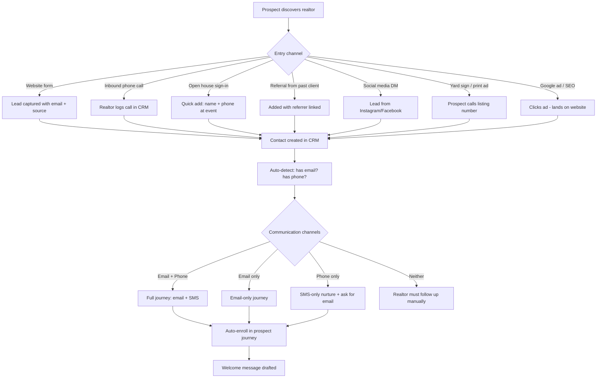

### 1B. Welcome + First Engagement

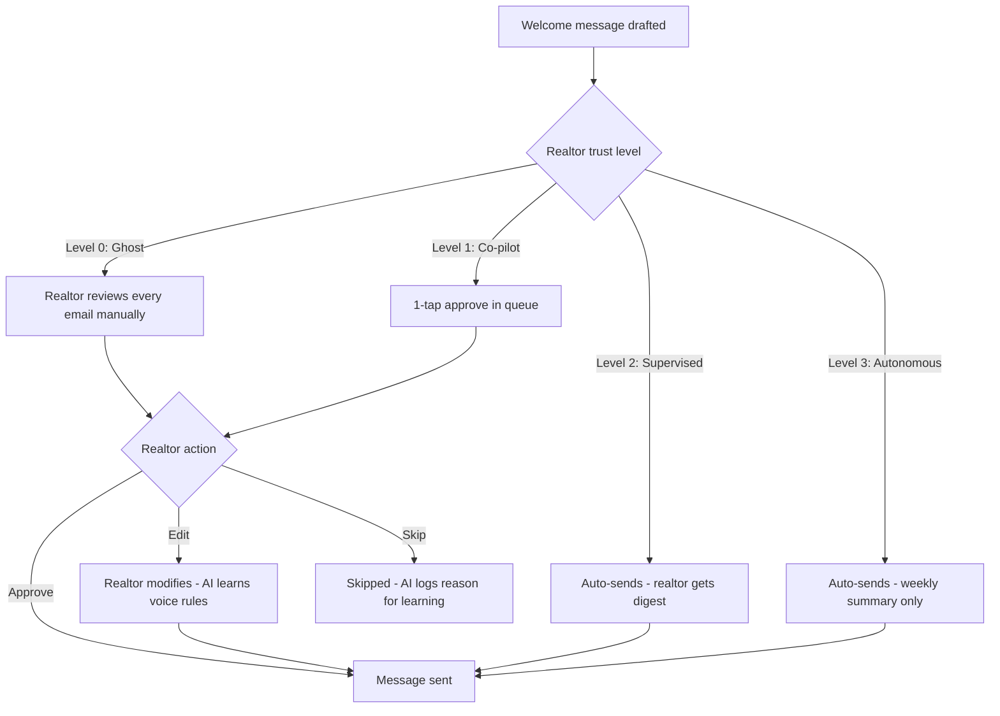

### 1C. Engagement Tracking — Email + Direct Contact

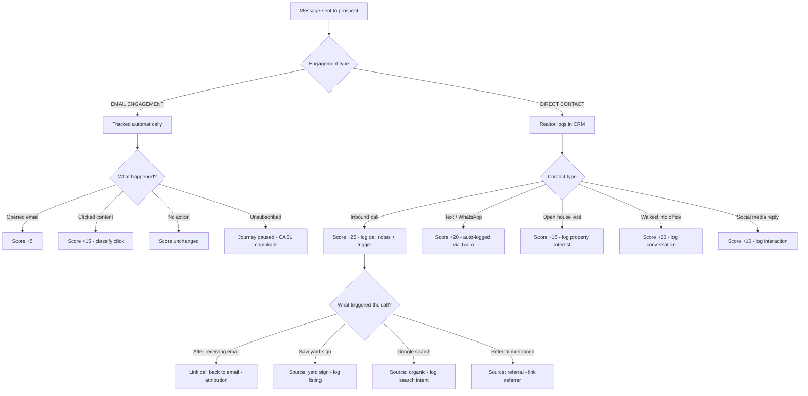

### 1D. Click Intelligence — What Clicks Reveal

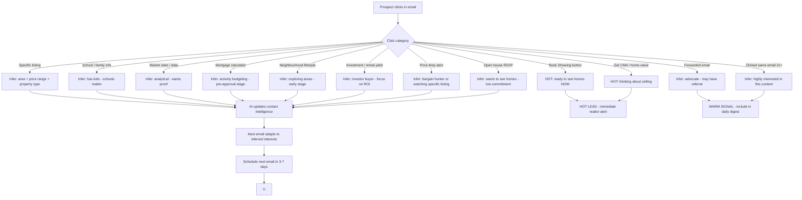

### 1E. Graduated Escalation — When Does the Realtor Step In?

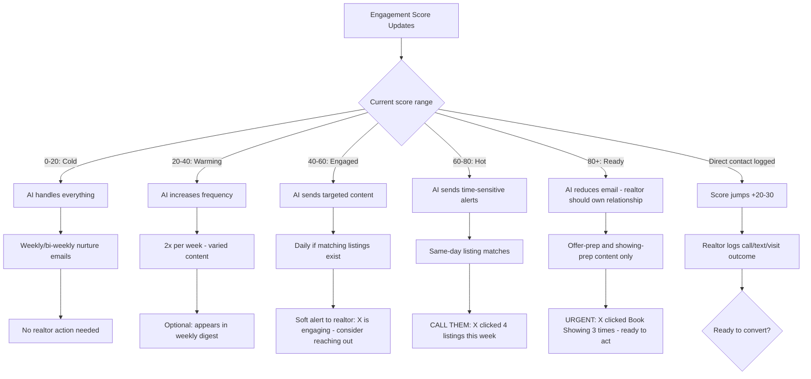

### 1F. Conversion — Prospect Becomes Buyer or Seller

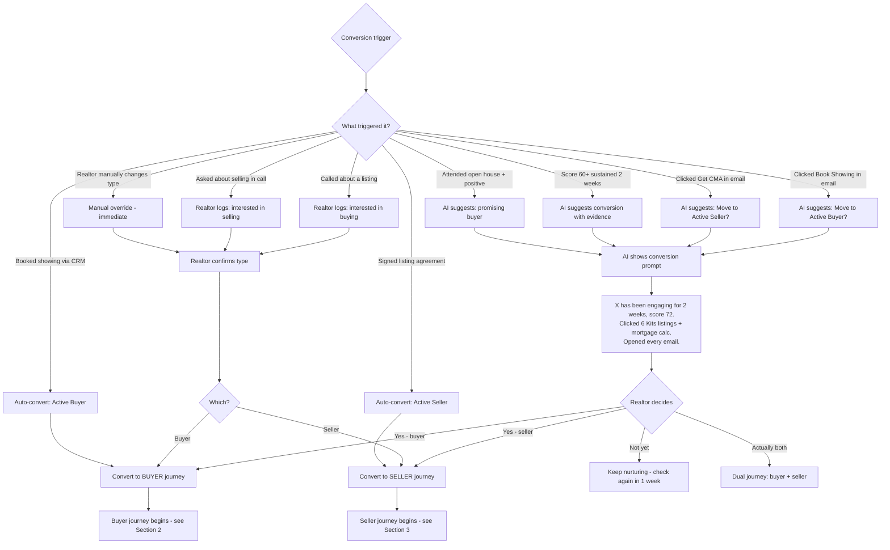

### 1G. Dormancy + Re-engagement

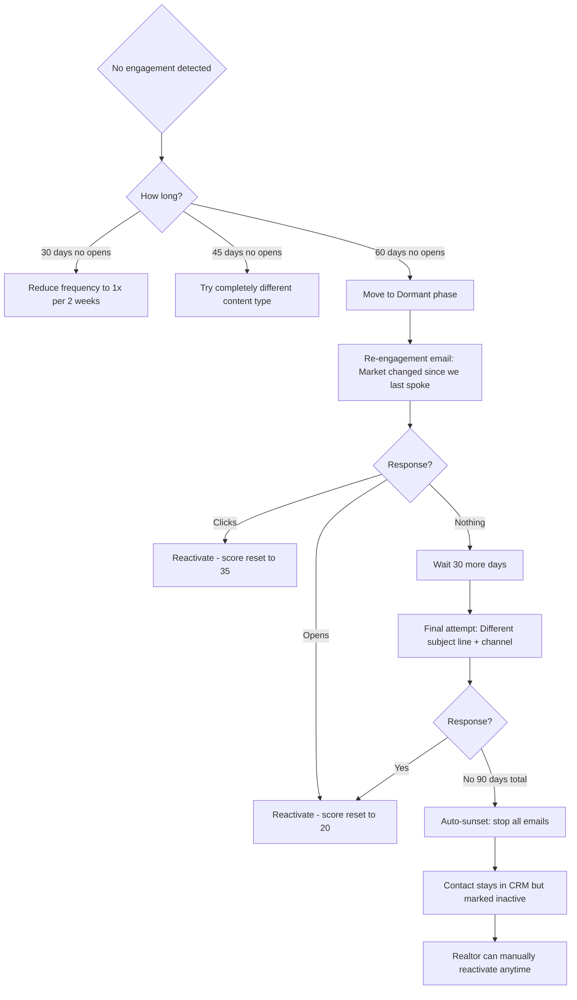

### Key Decision Points

| # | Decision | Who Decides | Data Used |
|---|----------|-------------|-----------|
| 1 | Welcome email content | AI + Realtor | Contact type, notes, area, source |
| 2 | What to send next | AI Agent | Click history (12 categories), engagement score, inferred interests |
| 3 | When to send | AI Agent | Optimal send time, frequency cap, last email date, score-based frequency |
| 4 | Whether to send at all | Send Governor | Engagement trend, frequency limit, CASL status, sunset rules |
| 5 | Hot lead alert | AI Agent | Click type (showing/CMA = hot), engagement velocity, direct contact |
| 6 | Soft alert (daily digest) | AI Agent | Score 40-60, consistent engagement pattern |
| 7 | Convert to buyer/seller | AI suggests + Realtor confirms | Score 60+, click patterns, direct contact outcome |
| 8 | Dormancy handling | AI Agent | Days since last open, content type exhaustion |
| 9 | Attribution | System | Link calls/showings back to emails that triggered them |
| 10 | Reactivation | AI or Realtor | Re-engagement click, or manual override |

### Click Intelligence Categories (12)

| Category | Signal | AI Response | Score Impact |
|---|---|---|---|
| Specific listing | Interested in that type/area/price | Narrow future listings | +15 |
| School / family info | Has kids, schools matter | Family-angle content | +10 |
| Market stats / data | Analytical, wants proof | Data-heavy emails | +10 |
| Mortgage calculator | Actively budgeting | Pre-approval info + affordable listings | +20 |
| Neighbourhood lifestyle | Exploring areas, early stage | Area comparison content | +10 |
| Book Showing button | Ready to act NOW | HOT LEAD alert | +30 |
| Get CMA / home value | Thinking about selling | Switch to seller nurture | +30 |
| Investment / rental yield | Investor buyer | Focus on ROI and cap rates | +15 |
| Price drop alert | Bargain hunter or watching | Re-send listing with urgency | +10 |
| Open house RSVP | Wants to see homes, low commitment | Open house roundups | +15 |
| Forwarded email | Advocate, potential referral | Referral incentive | +5 |
| Multiple clicks same email | Highly interested in this content | More of this type | +10 |

### Engagement Score Thresholds

| Score | Label | AI Frequency | Realtor Action |
|---|---|---|---|
| 0-20 | Cold | Weekly | None |
| 20-40 | Warming | 2x/week | In weekly digest |
| 40-60 | Engaged | Daily if inventory | Soft alert: consider reaching out |
| 60-80 | Hot | Same-day matches | Call them: high engagement |
| 80+ | Ready | Reduce email, realtor owns it | Urgent: ready to act |

---

## 2. Buyer Journey

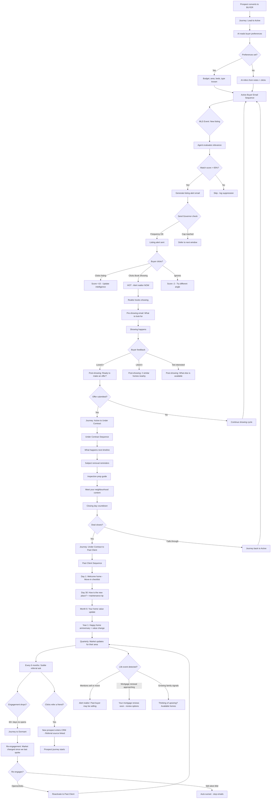

### Buyer Email Touchpoints

| Phase | Trigger | Email Type | Frequency |
|-------|---------|-----------|-----------|
| Active Search | New listing matches | Listing Alert | Real-time (max 3/week) |
| Active Search | Weekly digest | Your Weekly Roundup | Weekly |
| Active Search | Market shift | Market Update | Monthly |
| Pre-Showing | Showing booked | What to look for | Once per showing |
| Post-Showing | Showing completed | Feedback + similar homes | 24h after showing |
| Under Contract | Offer accepted | What happens next | Immediately |
| Under Contract | Milestones | Subject removal, inspection, closing | Event-driven |
| Past Client | Day 1 | Move-in checklist | Once |
| Past Client | Day 30 | How's the new place? | Once |
| Past Client | Month 6 | Home value update | Once |
| Past Client | Year 1+ | Home anniversary | Annually |
| Past Client | Ongoing | Area market updates | Quarterly |
| Past Client | Ongoing | Referral ask | Every 6 months |
| Dormant | 60d no engagement | Re-engagement | Once |

---

## 3. Seller Journey

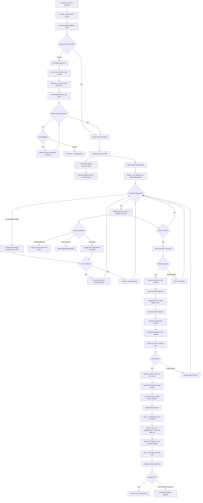

---

## 4. Other Agents Journey

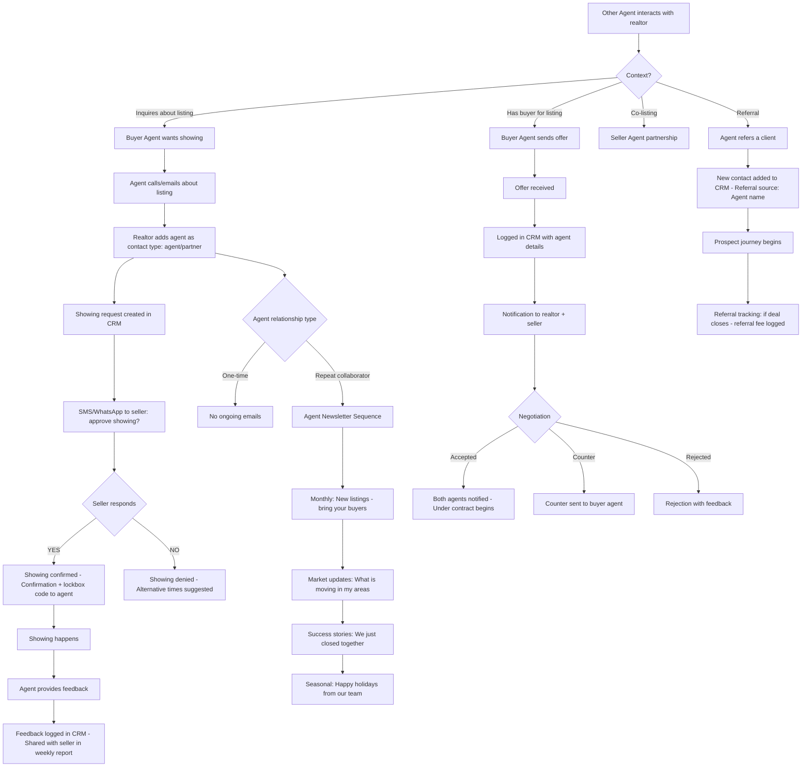

---

## 5. Realtor Daily Workflow

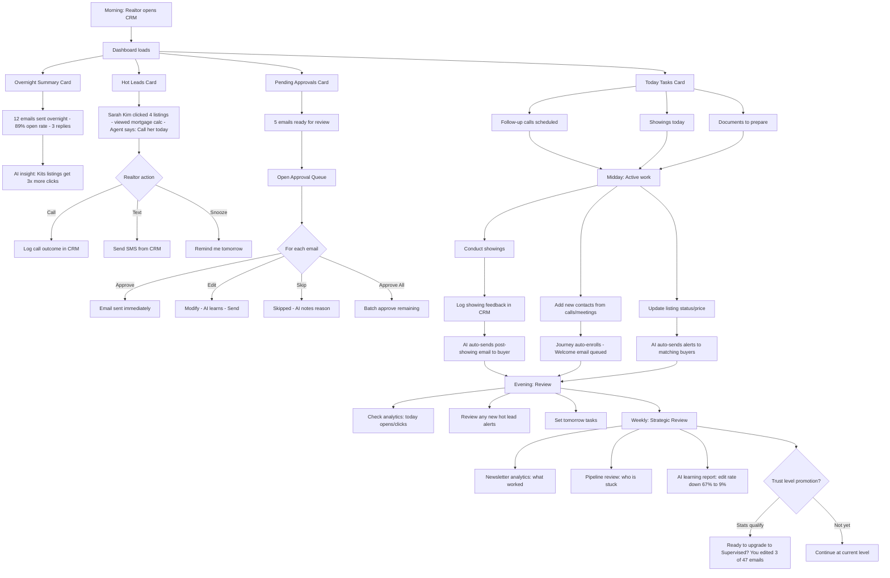

---

## 6. Quick Contact Lookup

1. Press Cmd+K from any page
2. Type contact name — results appear in 300ms (debounced search against `/api/contacts?search=`)
3. Click result — navigate to contact detail page (`/contacts/{id}`)
4. Recent item saved automatically in sidebar via Zustand persist store

---

## 7. Triage Dashboard

1. Land on dashboard — see Today's Priorities card at the top (overdue tasks, hot leads, pending showings)
2. Scroll to Activity Feed — see what happened recently (communications, email events, showing changes, completed tasks)
3. Check Deal Pipeline widget — see active deals grouped by stage with values
4. Click KPI card — navigate to filtered list (e.g., click "Active Listings" to go to `/listings?status=active`)

---

## 8. Contact Management

1. Open `/contacts` — see paginated DataTable with avatars, lead scores, stages
2. Search by name — table filters instantly via search input
3. Hover row — call/email/preview icons appear (inline quick actions)
4. Click eye icon — preview sheet slides open showing contact info + recent communications
5. Select checkboxes on multiple rows — bulk action bar appears at bottom of screen
6. Click "Change Stage" in bulk bar — update multiple contacts' stage in one action

---

## 9. Showing Workflow

1. Schedule showing — notification fires to realtor (notification center bell shows unread count)
2. Confirm showing — notification fires to buyer agent, calendar event updated
3. Complete showing — feedback SMS sent to buyer agent via Twilio asking for 1-5 rating and comments

---

*Generated 2026-03-23, updated 2026-04-10 — Realtors360 CRM*
