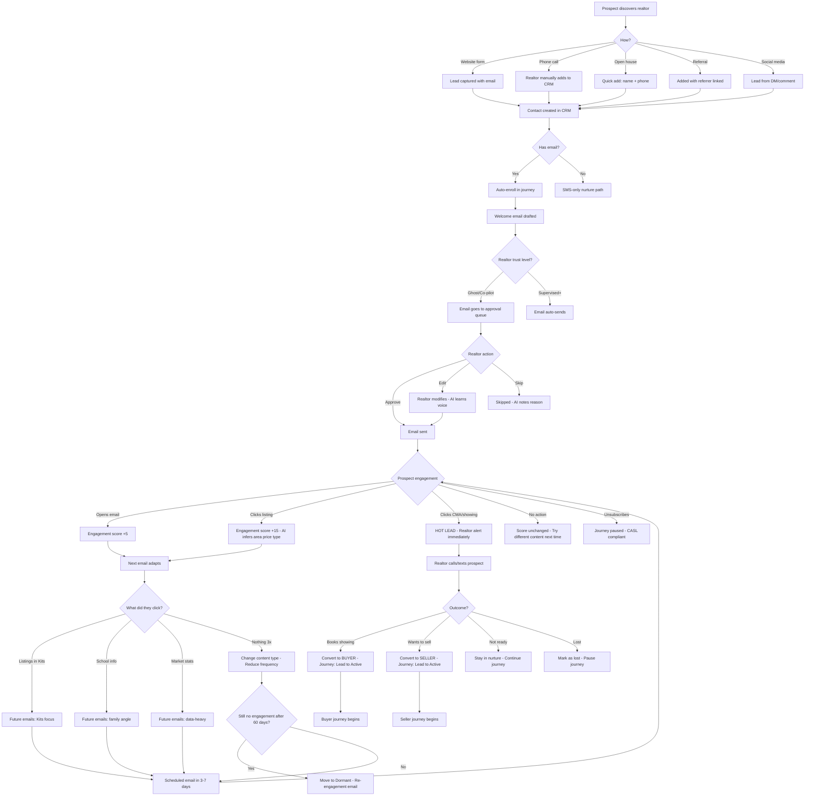
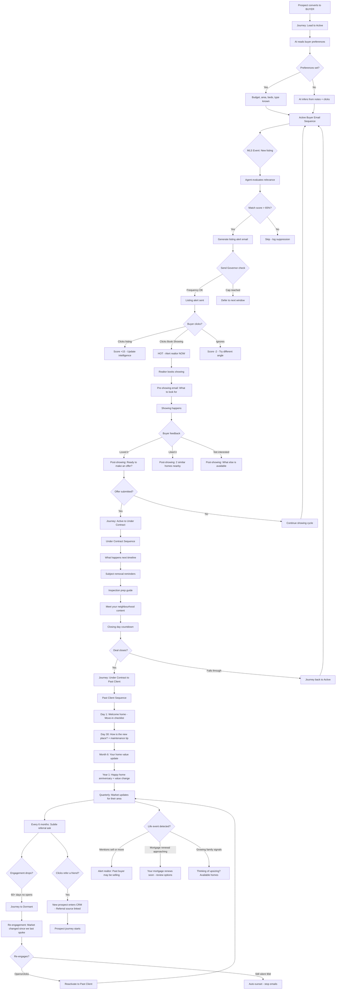
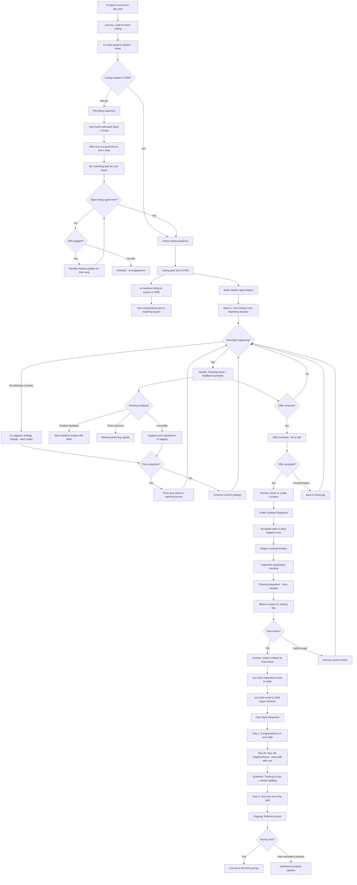
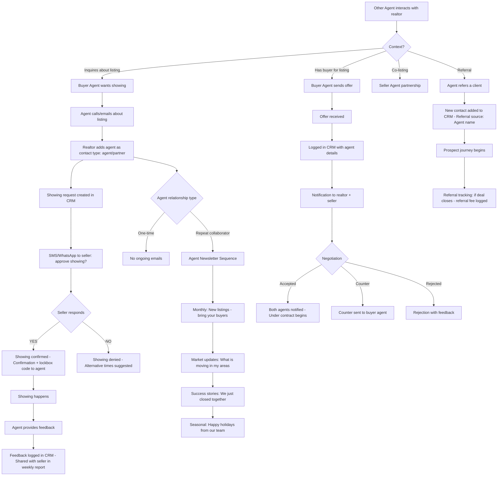
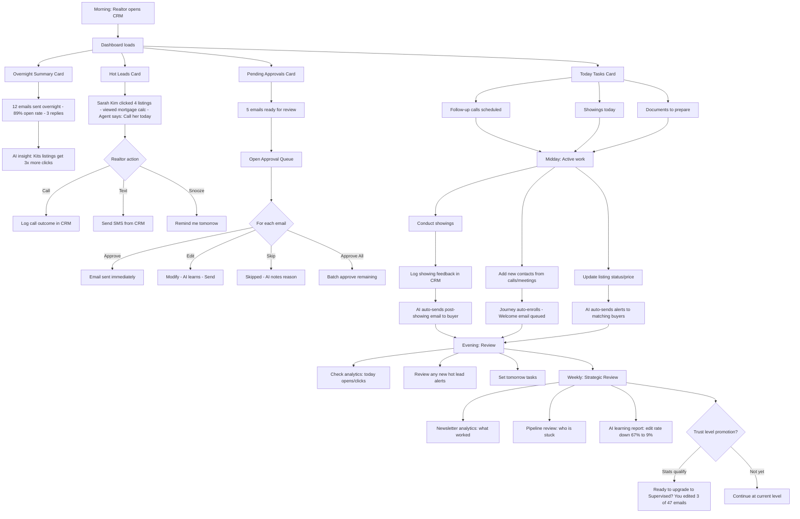

# ListingFlow — User Journey Maps

## 5 Personas
1. **Prospect** — potential buyer or seller discovering the realtor
2. **Buyer** — active home searcher through purchase and post-close
3. **Seller** — listing through sale and post-close
4. **Other Agents** — buyer/seller agents collaborating
5. **Realtor** — daily workflow using the CRM

---

## 1. Prospect Journey

### Key Decision Points

| # | Decision | Who Decides | Data Used |
|---|----------|-------------|-----------|
| 1 | Welcome email content | AI + Realtor | Contact type, notes, area from form |
| 2 | What to send next | AI Agent | Click history, engagement score, inferred interests |
| 3 | When to send | AI Agent | Optimal send time, frequency cap, last email date |
| 4 | Whether to send at all | Send Governor | Engagement trend, frequency limit, CASL status |
| 5 | Hot lead alert | AI Agent | Click type (showing/CMA = hot), engagement velocity |
| 6 | Convert to buyer/seller | Realtor | Phone call outcome, prospect's stated intent |

---

## 2. Buyer Journey

### Buyer Email Touchpoints

| Phase | Trigger | Email Type | Frequency |
|-------|---------|-----------|-----------|
| Active Search | New listing matches | Listing Alert | Real-time (max 3/week) |
| Active Search | Weekly digest | Your Weekly Roundup | Weekly |
| Active Search | Market shift | Market Update | Monthly |
| Pre-Showing | Showing booked | What to look for | Once per showing |
| Post-Showing | Showing completed | Feedback + similar homes | 24h after showing |
| Under Contract | Offer accepted | What happens next | Immediately |
| Under Contract | Milestones | Subject removal, inspection, closing | Event-driven |
| Past Client | Day 1 | Move-in checklist | Once |
| Past Client | Day 30 | How's the new place? | Once |
| Past Client | Month 6 | Home value update | Once |
| Past Client | Year 1+ | Home anniversary | Annually |
| Past Client | Ongoing | Area market updates | Quarterly |
| Past Client | Ongoing | Referral ask | Every 6 months |
| Dormant | 60d no engagement | Re-engagement | Once |

---

## 3. Seller Journey

---

## 4. Other Agents Journey

---

## 5. Realtor Daily Workflow

---

*Generated 2026-03-23 — ListingFlow CRM*
